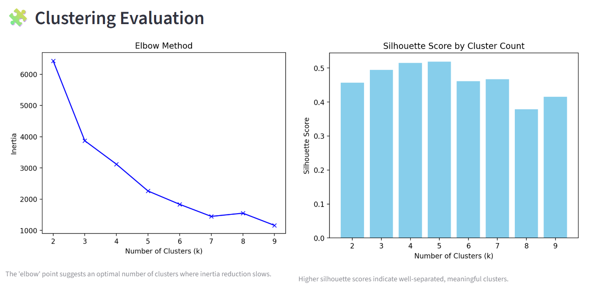
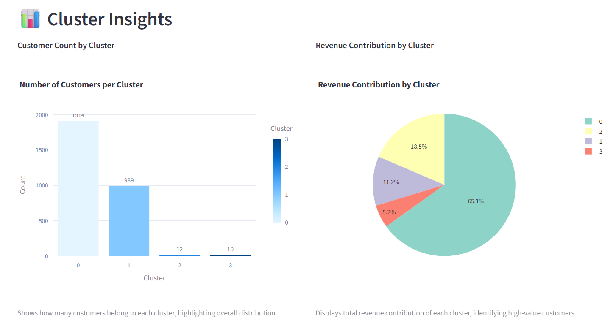
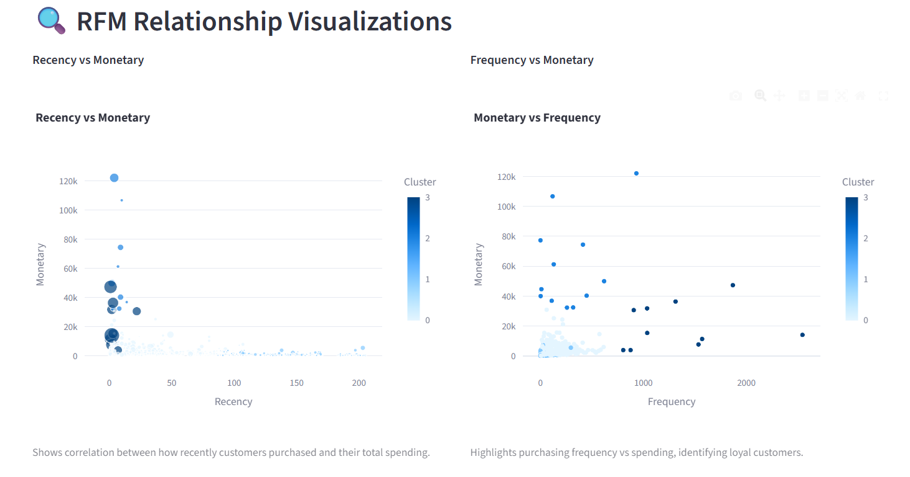
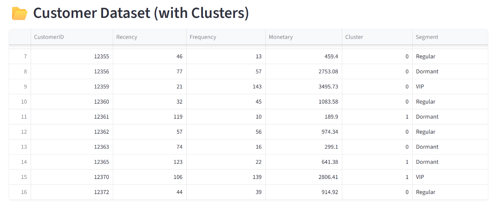
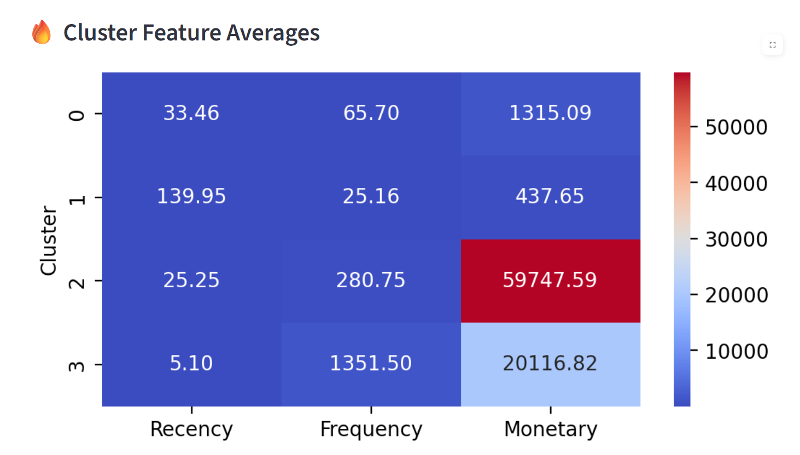

# 🧑‍💼 Customer Segmentation

A comprehensive project for customer segmentation using unsupervised machine learning techniques. This repository demonstrates the process of clustering customers based on their Recency, Frequency, and Monetary (RFM) features and visualizes key insights to drive business decisions.

---

## 🚀 Overview

Customer segmentation enables businesses to group their customers by purchasing behaviors, helping tailor marketing strategies and improve customer retention. This project uses clustering algorithms (K-Means) to identify distinct groups within customer data and visualizes their characteristics.

---

## 📁 Folder Structure
```text
ecommerce-customer-segmentation/
│
├── assets/
│   ├── screenshots/
│   │   ├── dashboard.png
│   │   ├── cluster_evaluation.png
│   │   ├── cluster_insights.png
│   │   ├── cluster_feature_averages.png
│   │
│   ├── data/
│   │     ├── processed/
│   │     │      └── rfm_clusters.csv
│   │     ├── raw
│   │          └── data.csv
│   └── images/
│       ├── logo.png
│       ├── wb1.png
│       └── workflow.png
├── app.py
│
├── notebooks/
│   └── customer_segmentation.ipynb
├── requirements.txt
└── README.md
```

## 🖼️ Screenshots

### Clustering Evaluation

Shows how the optimal number of clusters is determined using the Elbow and Silhouette methods.



---

### Cluster Insights

Visualizes customer distribution across clusters and their revenue contribution.



---

### Cluster Feature Averages

Highlights average RFM values for each cluster, revealing behavioral differences.



---

### Customer Dataset

Displays a sample of the segmented customer dataset, including assigned clusters and business labels.



---

### Cluster Heatmap
Displays a heatmap visualizing the feature distribution across clusters, helping identify patterns and similarities in customer behavior.



---

## 📦 Requirements

- Python 3.9+
- pandas, numpy, scikit-learn, matplotlib, seaborn, plotly, streamlit

Install dependencies:

```bash
pip install -r requirements.txt
```

---

## 📝 Usage

Clone the repo and run the main notebook or app:

```bash
git clone https://github.com/yourusername/customer-segmentation-ecommerce.git
cd customer-segmentation-ecommerce
jupyter notebook notebooks/customer_segmentation.ipynb
# or run the dashboard
streamlit run app/app.py
```

---

## 💡 Applications

- Targeted marketing campaigns
- Loyalty program design
- Churn prediction
- Product recommendations

---

## 🤝 Contributing

Contributions and suggestions are welcome! Please open an issue or submit a pull request.

---

## 📄 License

This project is licensed under the MIT License.

---

## ✨ Acknowledgements

Special thanks to the open-source data science community for inspiration and helpful resources.
