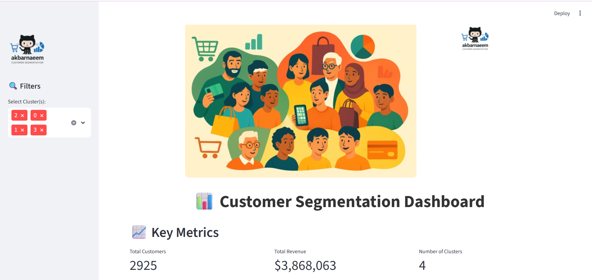
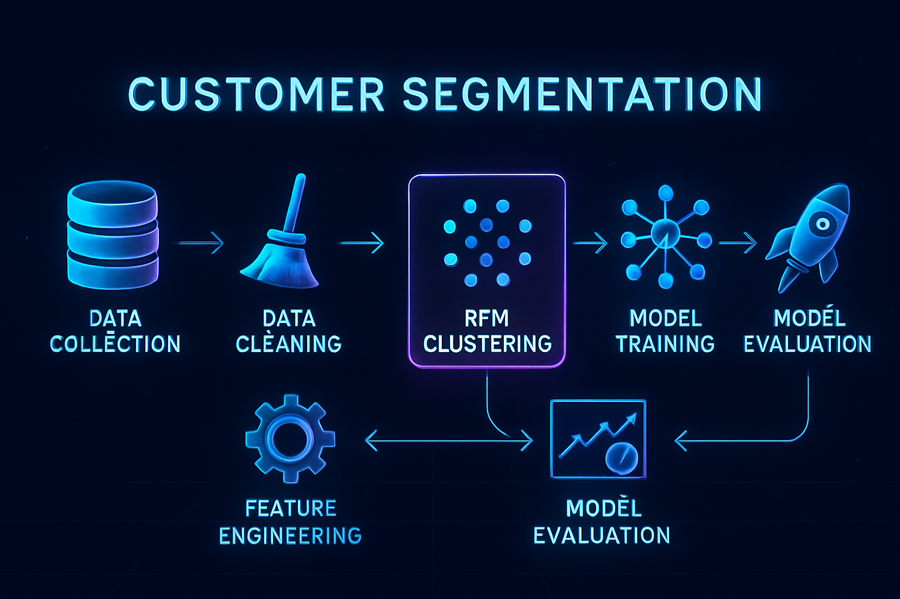

# 🧑‍💼 Customer Segmentation

A comprehensive project for customer segmentation using unsupervised machine learning techniques. This repository demonstrates the process of clustering customers based on their Recency, Frequency, and Monetary (RFM) features and visualizes key insights to drive business decisions.

---

## 🚀 Overview

Customer segmentation enables businesses to group their customers by purchasing behaviors, helping tailor marketing strategies and improve customer retention. This project uses clustering algorithms (K-Means) to identify distinct groups within customer data and visualizes their characteristics.

---

## 📁 Folder Structure
```text
ecommerce-customer-segmentation/
│
├── assets/
│   ├── screenshots/
│   │   ├── dashboard.png
│   │   ├── cluster_evaluation.png
│   │   ├── cluster_insights.png
│   │   ├── cluster_feature_averages.png
│   │
│   ├── data/
│   │     ├── processed/
│   │     │      └── rfm_clusters.csv
│   │     ├── raw
│   │          └── data.csv
│   └── images/
│       ├── logo.png
│       ├── wb1.png
│       └── workflow.png
├── app.py
│
├── notebooks/
│   └── customer_segmentation.ipynb
├── requirements.txt
└── README.md
```

## 🖼️ Screenshots

### Customer Segmentation Dashboard

Interactive dashboard summarizing cluster selection, key metrics, and segmentation of all customers.



---

### Workflow

Visual representation of the end-to-end customer segmentation pipeline, from data collection to model evaluation.



---

### Clustering Evaluation

Shows how the optimal number of clusters is determined using the Elbow and Silhouette methods.


---

### Cluster Insights

Visualizes customer distribution across clusters and their revenue contribution.


---

### Cluster Feature Averages

Highlights average RFM values for each cluster, revealing behavioral differences.


---

### Customer Dataset (with Clusters)

Displays a sample of the segmented customer dataset, including assigned clusters and business labels.


---

### Cluster Heatmap
Displays a heatmap visualizing the feature distribution across clusters, helping identify patterns and similarities in customer behavior.


---

## 📊 Key Features

- **RFM Feature Engineering:** Extracts Recency, Frequency, and Monetary features from raw transaction data.
- **Clustering Algorithms:** Applies K-Means clustering and evaluates cluster quality with Elbow and Silhouette methods.
- **Insightful Visualizations:** Provides easy-to-understand charts and tables for business users.
- **Interactive Dashboard:** Filter customers by cluster and view key metrics dynamically.

---

## 🛠️ How It Works

1. **Data Preparation:** Raw transaction data is preprocessed and transformed into RFM metrics.
2. **Clustering:** K-Means algorithm segments customers into meaningful groups.
3. **Evaluation:** Optimal cluster count is found using Elbow and Silhouette scores.
4. **Labeling:** Business-friendly segment labels (e.g., VIP, Regular, Dormant) are assigned to clusters.
5. **Visualization:** Key charts and tables are generated for analysis and strategy.

---

## 📦 Requirements

- Python 3.9+
- pandas, numpy, scikit-learn, matplotlib, seaborn, plotly, streamlit

Install dependencies:

```bash
pip install -r requirements.txt
```

---

## 📝 Usage

Clone the repo and run the main notebook or app:

```bash
git clone https://github.com/yourusername/customer-segmentation-ecommerce.git
cd customer-segmentation-ecommerce
jupyter notebook notebooks/customer_segmentation.ipynb
# or run the dashboard
streamlit run app/app.py
```

---

## 💡 Applications

- Targeted marketing campaigns
- Loyalty program design
- Churn prediction
- Product recommendations

---

## 🤝 Contributing

Contributions and suggestions are welcome! Please open an issue or submit a pull request.

---

## 📄 License

This project is licensed under the MIT License.

---

## ✨ Acknowledgements

Special thanks to the open-source data science community for inspiration and helpful resources.
